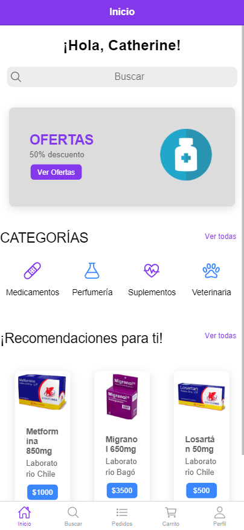
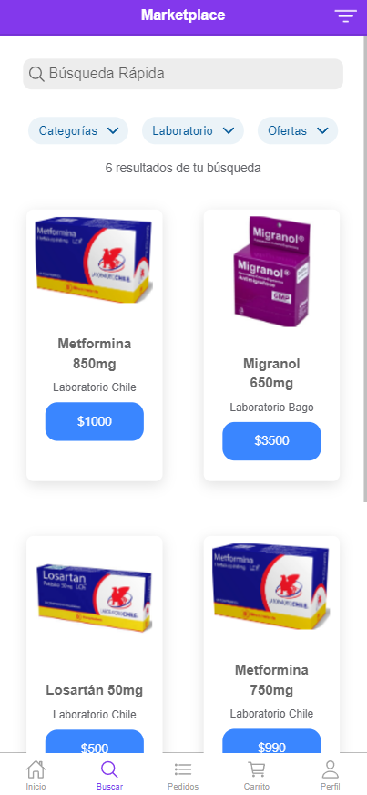
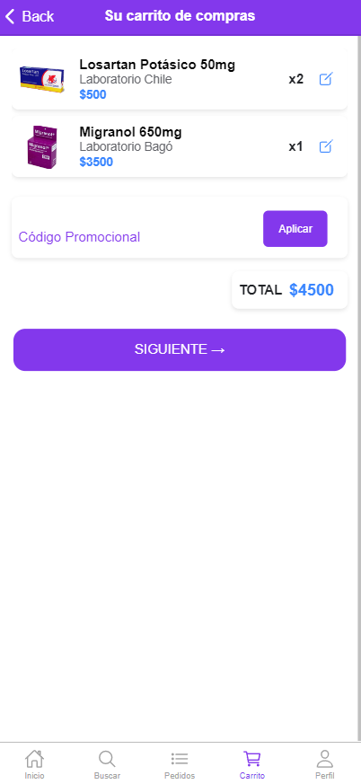
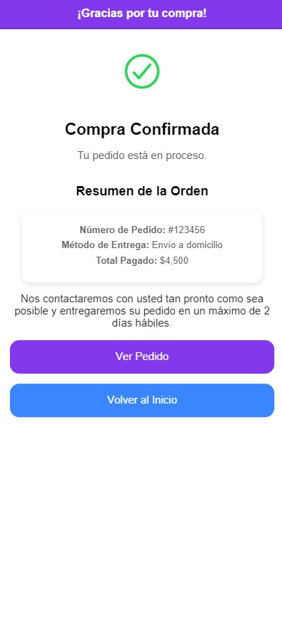

# 🏥 **Farmacia Uniacc** 🏥

Bienvenido a **Farmacia Uniacc**, una aplicación de **delivery** de farmacia diseñada y desarrollada utilizando **Ionic** y **Angular**. Esta aplicación está actualmente en **fase beta**, enfocada en dispositivos móviles y optimizada para el **iPhone 14 Pro Max**. En el futuro, se ampliará su compatibilidad para dispositivos de diversas resoluciones, garantizando una experiencia completamente responsiva.

---

## 📦 **Descargar la Aplicación**

Puedes descargar el APK de la aplicación haciendo clic en el siguiente enlace:

[](https://github.com/DevMPoveaCL/FarmaciaUniacc/blob/main/app-debug.apk)

---

## 📱 **Vista Previa de la Aplicación**

### Pantallas Principales:
A continuación, puedes ver capturas de las principales pantallas de la aplicación ejecutándose en un iPhone 14 Pro Max:

  <p><strong>Pantalla de Inicio</strong></p>
  

  <p><strong>Marketplace</strong></p>
  

  <p><strong>Carrito</strong></p>
  
  
  <p><strong>Confirmación</strong></p>
  

---

## 🚀 **Pasos para Instalar y Ejecutar la Aplicación**

### **Requisitos Previos**
1. Tener **Node.js** y **npm** instalados en tu máquina.
2. Tener el CLI de Ionic instalado globalmente:
   ```bash
   npm install -g @ionic/cli

### **Pasos de Instalación**
1. Clonar el repositorio:
   ```bash
   git clone https://github.com/DevMPoveaCL/Farmacia-Uniacc.git

2. Navegar al directorio del proyecto:
   ```bash
   cd Farmacia-Uniacc

3. Instalar las dependencias:
   ```bash
   npm install

4. Ejecutar la aplicación en modo desarrollo:
   ```bash
   ionic serve
5. Abre tu navegador y navega a la URL (Se recomienda usar Devtools con un Iphone 14 Pro Max en el navegador):
   ```bash
   http://localhost:8100/inicio

---

## 🔧 **Problemas Encontrados y Soluciones**

Durante el desarrollo de la aplicación, nos enfrentamos a diversos retos. A continuación, se describen los principales **problemas** y las **soluciones** implementadas:

1. **Generación del proyecto en versión standalone**  
   - **Problema:** Al generar el proyecto como standalone, las rutas no funcionaban correctamente y había conflictos con la integración de módulos.  
   - **Solución:** Se recreó el proyecto utilizando **ngModules**, lo que permitió una gestión más eficiente de las rutas y mejoró las transiciones entre páginas.

2. **Inconsistencias con el modo oscuro**  
   - **Problema:** El modo oscuro activado por defecto en Ionic generaba inconsistencias visuales en la interfaz, especialmente con los colores.  
   - **Solución:** Se desactivó el modo oscuro y se ajustaron los colores personalizados en el archivo `variables.scss`.

3. **Paleta de colores personalizada**  
   - **Problema:** Los colores predeterminados de Ionic no se alineaban con el diseño visual deseado.  
   - **Solución:** Se definió una paleta de colores personalizada en `variables.scss`, logrando un diseño más fiel al concepto original.

4. **Problemas con el binding de datos**  
   - **Problema:** Los campos del formulario (inputs, select, radio buttons) no reflejaban correctamente los datos en el componente TypeScript.  
   - **Solución:** Se implementó correctamente el **two-way data binding** utilizando `[(ngModel)]` y se verificó la configuración del módulo **FormsModule**.

5. **Responsividad**  
   - **Problema:** La aplicación inicialmente no se ajustaba correctamente en pantallas pequeñas.  
   - **Solución:** Se ajustaron los estilos con **flexbox** y valores dinámicos para garantizar una visualización óptima en el **iPhone 14 Pro Max**.

---

## 💻 **Tecnologías Usadas**

- **Ionic:** Framework para el desarrollo de aplicaciones móviles híbridas.  
- **Angular:** Framework para el desarrollo de aplicaciones web dinámicas.  
- **SCSS:** Lenguaje de preprocesador CSS para mejorar la organización de los estilos.  
- **HTML:** Lenguaje de marcado para la estructura de la aplicación.

---

## 👨‍💻 **Autor**

**Marco Povea:** Desarrollador de la aplicación como parte de un ejercicio práctico en el curso de **Taller de Dispositivos Móviles**.

---

## 🌟 **Notas Finales**
- Esta aplicación se encuentra en fase beta y actualmente está optimizada para dispositivos iPhone 14 Pro Max.
- En futuras versiones, se mejorará la responsividad para una amplia gama de dispositivos.

---

¡Gracias por visitar el proyecto de Farmacia Uniacc! 🚀 Si tienes alguna pregunta o sugerencia, no dudes en contactarme. 
Atte. DevMPoveaCL😊